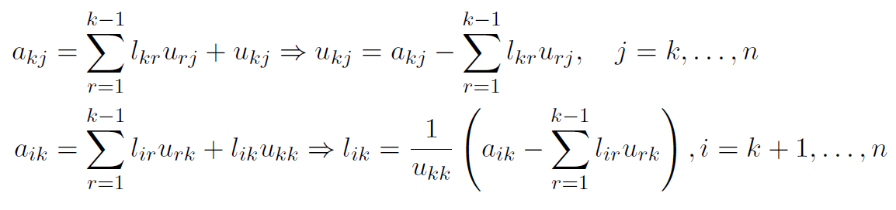
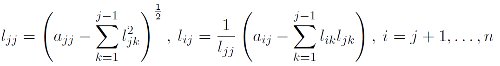
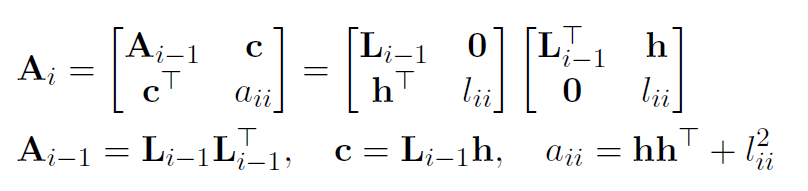

# Week 4-2

## 直接三角分解法

$$A=LU$$

### Doolittle方法

$$u_{1j}=a_{1j}$$
$$l_{i1}=\frac{a_{i1}}{u_{11}}$$

## 对称矩阵的Cholesky方法

A是对称正定矩阵
$$A=LL^\top$$

### 平方根法

### 加边的Cholesky方法

### 对称非定矩阵

A对称且顺序主子式>0
$$A=LDL^\top$$

A对称且非奇异
$$PAP^\top=LDL^\top$$

## 带状矩阵分解方法

### 三对角矩阵的分解和追赶法

$$Ax=d$$
$$A=LU$$

$$u_1=b_1$$
$$l_i=\frac{a_i}{u_{i-1}}$$
$$u_i=b_i-l_ic_{i-1}$$

得到$LU$后，再解$Ly=d, Ux=y$

### 循环三对角矩阵、带状矩阵

循环三对角矩阵：右上角和左下角参数循环

带状矩阵（$b_L, b_U$）可以分解为下带宽为$b_L$的$L$和上带宽为$b_U$的$U$

