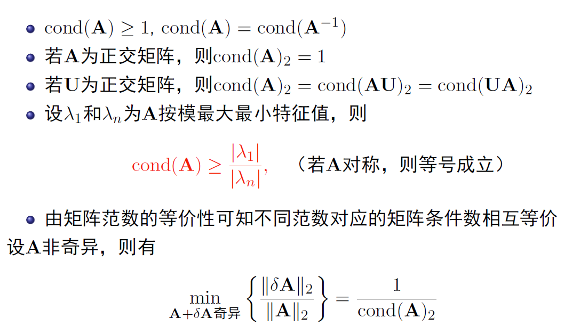

# Week 4-3

## 矩阵病态现象

### 扰动误差分析

$$Ax=b\rightarrow (A+\delta A)(x+\delta x)=b+\delta b$$

### 矩阵条件数

$$cond(A)=\|A\|\|A^{-1}\|$$

常用条件数

* $cond(A)_1=\|A\|_1\|A^{-1}\|_1$
* $cond(A)_2=\|A\|_2\|A^{-1}\|_2$
* $cond(A)_\infty=\|A\|_\infty\|A^{-1}\|_\infty$

条件数性质

近似解的范围

$$\frac{1}{cond(A)}\frac{\|r\|}{\|b\|}\leq \frac{\|\tilde{x}-x\|}{\|x\|}\leq cond(A)\frac{\|r\|}{\|b\|} $$

### 预处理

$$Ax=b\rightarrow (PAQ)y=Pb$$
行平衡
$$P=D=diag(S_1^{-1},\cdots,S_n^{-1}), Q=I $$
列平衡
$$P=I,Q=D=diag(S_1^{-1},\cdots,S_n^{-1})$$

### 舍入误差分析

向前误差分析：每一步都计算误差（很难实现）

向后误差分析：所有误差集中在$\delta A$上
